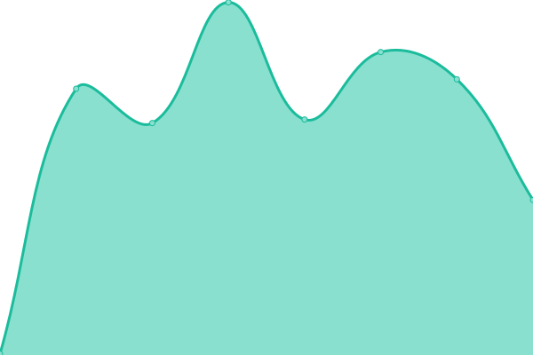
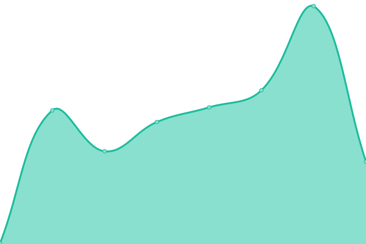
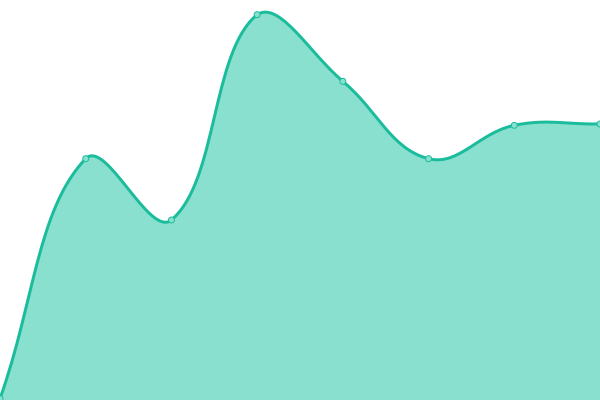

# [📈 Live Status](https://NeckbeardThePirate.github.io/jaech-upptime): <!--live status--> **🟩 All systems operational**

This repository contains the open-source uptime monitor and status page for [CF](https://NeckbeardThePirate.github.io/jaech-upptime), powered by [Upptime](https://github.com/upptime/upptime).

With [Upptime](https://upptime.js.org), you can get your own unlimited and free uptime monitor and status page, powered entirely by a GitHub repository. We use [Issues](https://github.com/NeckbeardThePirate/jaech-upptime/issues) as incident reports, [Actions](https://github.com/NeckbeardThePirate/jaech-upptime/actions) as uptime monitors, and [Pages](https://NeckbeardThePirate.github.io/jaech-upptime) for the status page.

<!--start: status pages-->
<!-- This summary is generated by Upptime (https://github.com/upptime/upptime) -->
<!-- Do not edit this manually, your changes will be overwritten -->
<!-- prettier-ignore -->
| URL | Status | History | Response Time | Uptime |
| --- | ------ | ------- | ------------- | ------ |
|  [Judah Helland](https://judahhelland.com) | 🟩 Up | [judah-helland.yml](https://github.com/NeckbeardThePirate/jaech-upptime/commits/HEAD/history/judah-helland.yml) | 

 212ms
     
 | 

<a href="https://NeckbeardThePirate.github.io/jaech-upptime/history/judah-helland">100.00%</a>
    

|  [Light Labs](https://labs.hellandcloud.com) | 🟩 Up | [light-labs.yml](https://github.com/NeckbeardThePirate/jaech-upptime/commits/HEAD/history/light-labs.yml) | 

 188ms
     
 | 

<a href="https://NeckbeardThePirate.github.io/jaech-upptime/history/light-labs">100.00%</a>
    

|  [Light Labs Beta](https://thelightlabs.dev) | 🟩 Up | [light-labs-beta.yml](https://github.com/NeckbeardThePirate/jaech-upptime/commits/HEAD/history/light-labs-beta.yml) | 

 210ms
     
 | 

<a href="https://NeckbeardThePirate.github.io/jaech-upptime/history/light-labs-beta">100.00%</a>
    

<!--end: status pages-->

[**Visit our status website →**](https://NeckbeardThePirate.github.io/jaech-upptime)

## 📄 License

- Powered by: [Upptime](https://github.com/upptime/upptime)
- Code: [MIT](./LICENSE) © [Anand Chowdhary](https://anandchowdhary.com), supported by [Pabio](https://pabio.com)
- Data in the `./history` directory: [Open Database License](https://opendatacommons.org/licenses/odbl/1-0/)
